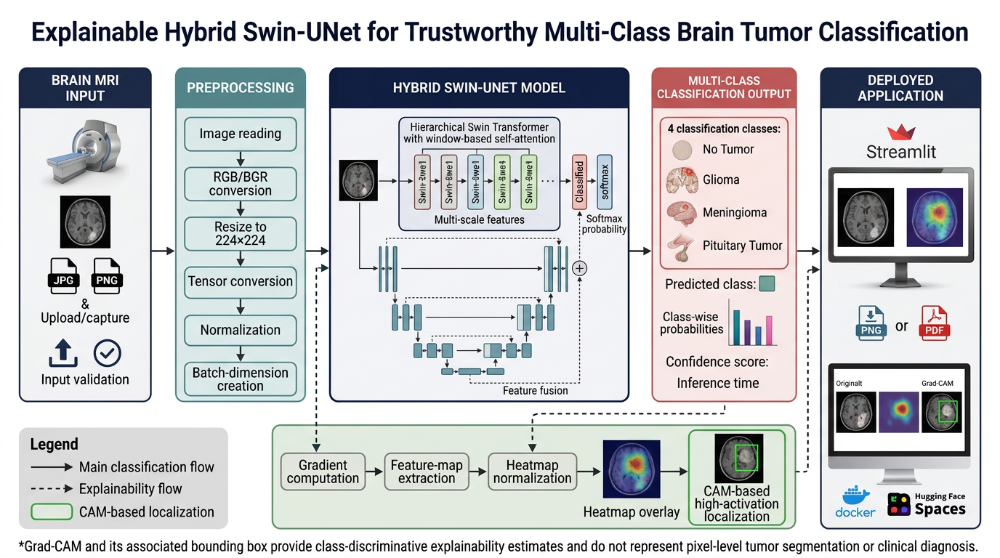
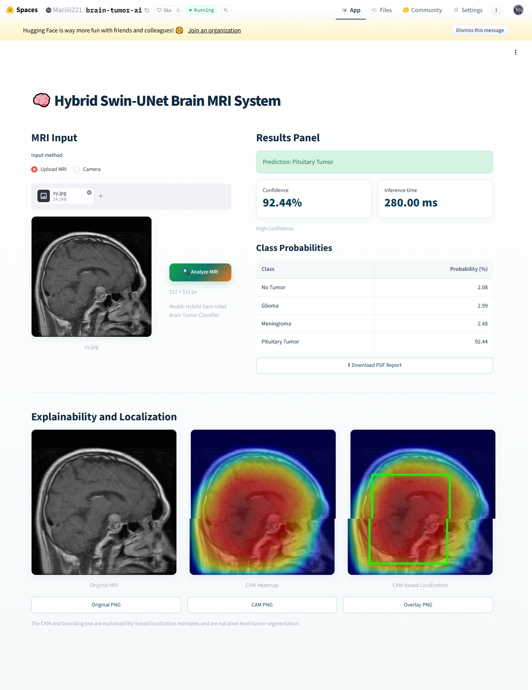
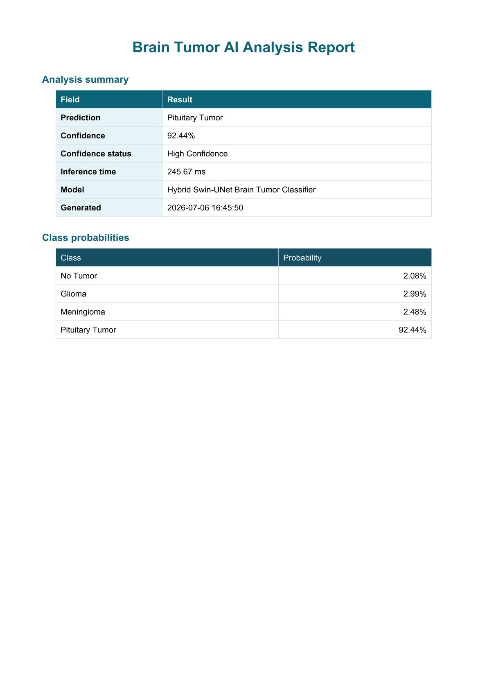
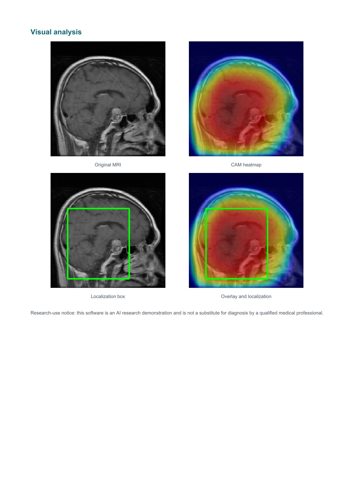

# Explainable Hybrid Swin-UNet for Multi-Class Brain Tumor Classification

An explainable deep-learning system for classifying brain MRI images into four categories: **No Tumor, Glioma, Meningioma, and Pituitary Tumor**.

The project combines a Hybrid Swin-UNet architecture with Grad-CAM explainability, CAM-based localization, class-wise probability estimation, downloadable visualizations, and automated PDF reporting.

## Live Application

[Launch the Public Brain MRI Analysis System](https://huggingface.co/spaces/Maciiii221/brain-tumor-ai)

## Project Overview

This project presents an explainable deep-learning framework for trustworthy multi-class brain tumor classification from MRI images.

The deployed system supports:

- Brain MRI image upload
- Camera-based MRI capture
- Four-class classification
- Prediction confidence
- Class-wise probability scores
- Inference-time measurement
- Grad-CAM heatmap generation
- CAM-based localization
- Downloadable PNG visualizations
- Automated PDF analysis reports
- Public deployment through Hugging Face Spaces

## Supported Classes

| Class | Description |
|---|---|
| No Tumor | MRI image without a detected tumor class |
| Glioma | Tumor originating from glial cells |
| Meningioma | Tumor associated with the meninges |
| Pituitary Tumor | Tumor located around the pituitary region |

## System Workflow

The complete workflow includes MRI input, preprocessing, Hybrid Swin-UNet inference, multi-class classification, Grad-CAM generation, CAM-based localization, report generation, and web deployment.



## Application Interface

The application provides a professional web interface for uploading MRI images, viewing classification results, inspecting class probabilities, and downloading visual and PDF outputs.



## Classification Result

The model returns:

- Predicted class
- Prediction confidence
- Class-wise probabilities
- Inference time
- Confidence status



## Explainability and Localization

Grad-CAM is used to visualize class-discriminative regions that influence the model prediction.

For tumor-class predictions, the system also produces a CAM-based localization box around the most activated image region.



## Main Features

- Four-class brain MRI classification
- Hybrid Swin-UNet architecture
- Swin Transformer-based feature extraction
- U-Net-inspired feature processing
- Class-wise softmax probabilities
- Prediction-confidence estimation
- Inference-time measurement
- Grad-CAM explainability
- CAM-based localization visualization
- Original MRI download
- Heatmap download
- Localization overlay download
- Automated PDF report generation
- Streamlit web interface
- Docker-based deployment
- Public Hugging Face Spaces hosting

## Technology Stack

- Python
- PyTorch
- Swin Transformer
- U-Net
- OpenCV
- NumPy
- Pillow
- Streamlit
- Grad-CAM
- ReportLab
- Docker
- Hugging Face Spaces

## Repository Structure

```text
explainable-hybrid-swin-unet-brain-tumor-classification/
│
├── app.py
├── config.py
├── Dockerfile
├── gradcam.py
├── history.py
├── model_loader.py
├── predictor.py
├── preprocess.py
├── report.py
├── requirements.txt
├── README.md
├── .gitignore
├── .gitattributes
├── __init__.py
│
└── assets/
    ├── application-interface.png
    ├── prediction-result.jpg
    ├── gradcam-localization.jpg
    └── system-workflow.png
```

## Installation

### 1. Clone the repository

```bash
git clone https://github.com/Maciiii221/explainable-hybrid-swin-unet-brain-tumor-classification.git
```

### 2. Enter the project directory

```bash
cd explainable-hybrid-swin-unet-brain-tumor-classification
```

### 3. Create a virtual environment

```bash
python -m venv venv
```

### 4. Activate the virtual environment

#### Windows Command Prompt

```bash
venv\Scripts\activate
```

#### Windows PowerShell

```powershell
.\venv\Scripts\Activate.ps1
```

#### Linux or macOS

```bash
source venv/bin/activate
```

### 5. Install the required packages

```bash
python -m pip install --upgrade pip
pip install -r requirements.txt
```

### 6. Add the trained model checkpoint

Place the trained model file in the project root:

```text
best_model.pth
```

The project directory should then contain:

```text
app.py
best_model.pth
config.py
...
```

### 7. Run the application

```bash
streamlit run app.py
```

The local application will normally open at:

```text
http://localhost:8501
```

## Model Checkpoint

The trained `best_model.pth` checkpoint is not included in this GitHub repository because it exceeds GitHub's standard individual-file size limit.

The complete working model can be tested through the public Hugging Face deployment:

[Open the Live Application](https://huggingface.co/spaces/Maciiii221/brain-tumor-ai)

## Input Requirements

The application accepts:

- JPG
- JPEG
- PNG

Recommended input:

- Brain MRI scan
- MRI film capture
- Printed MRI scan captured through the camera
- Clear image with minimal blur or obstruction

The model input is resized to:

```text
224 × 224 pixels
```

during preprocessing.

## Output Information

For every analyzed MRI image, the system provides:

1. Predicted class
2. Prediction confidence
3. Class-wise probabilities
4. Inference time
5. Original MRI visualization
6. Grad-CAM heatmap
7. CAM-based localization overlay
8. Downloadable PNG images
9. Downloadable PDF report

## Explainability Method

The explainability pipeline performs:

```text
Target-Class Prediction
        ↓
Feature-Map Extraction
        ↓
Gradient Computation
        ↓
Channel Importance Weighting
        ↓
Grad-CAM Heatmap
        ↓
Heatmap Overlay
        ↓
CAM-Based Localization
```

The generated heatmap identifies image regions that contributed strongly to the predicted class.

The bounding box represents a class-activation-based localization estimate and is not pixel-level tumor segmentation.

## Deployment

The application is deployed using:

```text
Docker
   ↓
Streamlit
   ↓
Hugging Face Spaces
```

Public deployment:

https://huggingface.co/spaces/Maciiii221/brain-tumor-ai

## Project Title

**Explainable Hybrid Swin-UNet for Trustworthy Multi-Class Brain Tumor Classification**

## Author

**M Asif Chishti**

## Keywords

Brain Tumor Classification, Brain MRI, Medical Imaging, Explainable AI, Grad-CAM, Swin Transformer, U-Net, Hybrid Swin-UNet, Deep Learning, PyTorch, Computer Vision, Medical AI, Streamlit, Hugging Face Spaces
